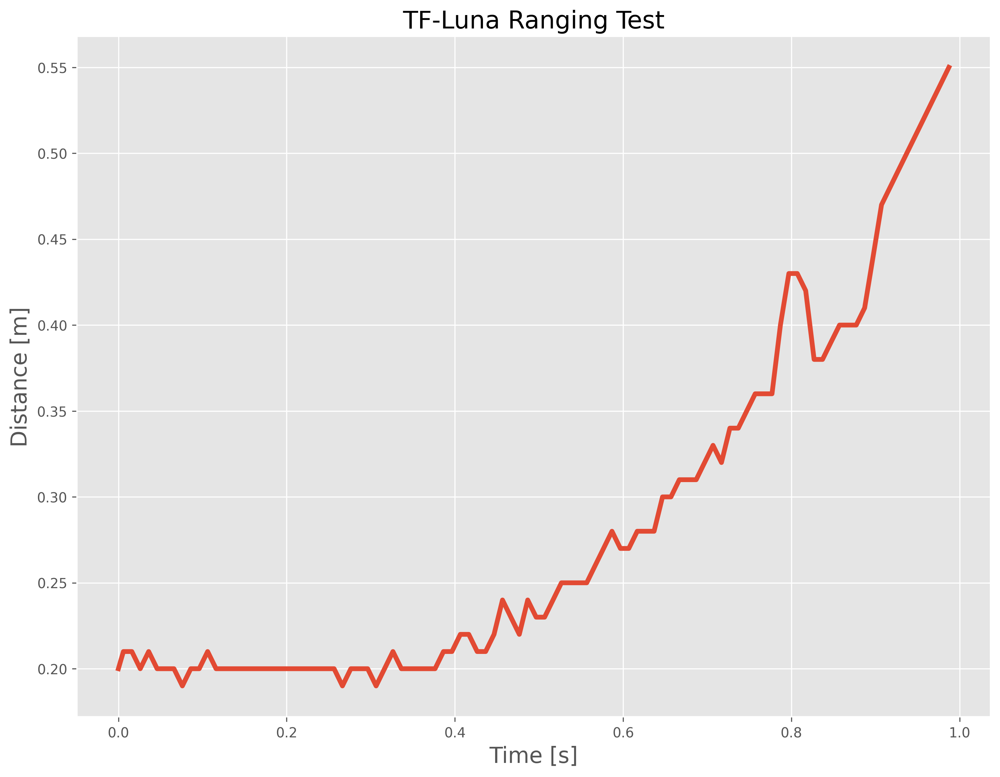

# TF-Luna LiDAR with Raspberry Pi
Python codes for configuring and reading the TF-Luna Light Detection And Ranging (LiDAR) module interfaced with a Raspberry Pi computer.

Tutorial: https://makersportal.com/blog

Buy a TF-Luna from our Store: https://makersportal.com/shop/tf-luna-lidar-module

#

### - TF-Luna + Raspberry Pi Wiring - 

The TF-Luna can be wired to the Raspberry Pi via the mini UART port:

---
### - TF-Luna Ranging Test - 

The script entitled 'tfluna_test_plot.py' outputs a plot similar to the following:

---
### - Real-Time Ranging Visualization - 

The script entitled 'tfluna_test_realtime.py' outputs a real-time output of distance and signal strength, similar to the following:

